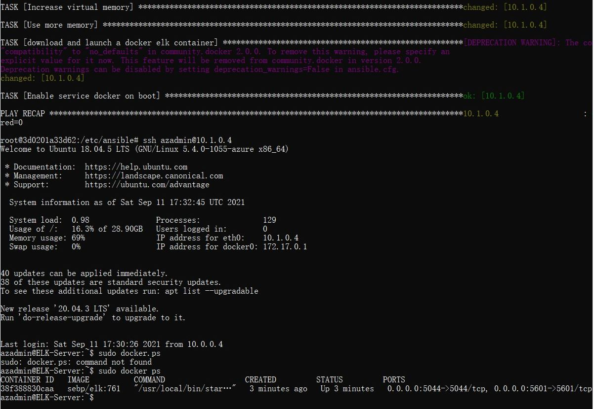
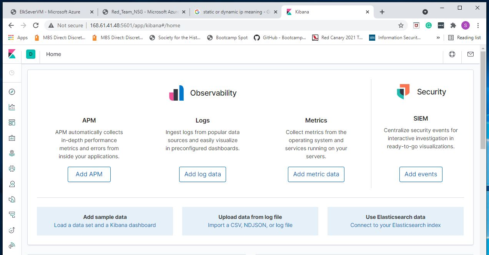

## Automated ELK Stack Deployment

The files in this repository were used to configure the network depicted below.

These files have been tested and used to generate a live ELK deployment on Azure. They can be used to either recreate the entire deployment pictured above. Alternatively, select portions of the "YAML" file may be used to install only certain pieces of it, such as Filebeat.

  - install-elk.yml
  - dvwa-playbook.yml
  - filebeat-playbook.yml
  - metricbeat-playbook.yml

This document contains the following details:
- Description of the Topology
- Access Policies
- ELK Configuration
  - Beats in Use
  - Machines Being Monitored
- How to Use the Ansible Build

### Description of the Topology

The main purpose of this network is to expose a load-balanced and monitored instance of DVWA, the D*mn Vulnerable Web Application.

Load balancing ensures that the application will be highly reliable, in addition to restricting access to the network..
- A load balancer protects against many common Distributed Denial of Service attacks. In addition, a jump box restricts network access to authorized personnel only.

Integrating an ELK server allows users to easily monitor the vulnerable VMs for changes to the system log files and system metrics and statistics.
- Filebeat monitors and records changes to the system log files.
- Metricbeat monitors records changes to server metrics and statistics.

The configuration details of each machine may be found below.

| Name          | Function             | IP Address   | Operating System     |
|---------------|----------------------|--------------|----------------------|
| Jump Box      | Jump Box Provisioner | 10.0.0.7     | Linux (Ubuntu 18.04) |
| Web-1         | Webserver            | 10.0.0.8     | Linux (Ubuntu 18.04) |
| Web-2         | Webserver            | 10.0.0.9     | Linux (Ubuntu 18.04) |
| Elk-Server    | Webserver            | 10.1.0.4     | Linux (Ubuntu 18.04) |
| RedTeamDVWALB | Load Balancer        | 13.83.133.17 | N/A                  |

### Access Policies

The machines on the internal network are not exposed to the public Internet. 

Only the Jump Box Provisioner machine can accept connections from the Internet. Access to this machine is only allowed from the following IP addresses:
- 73.250.253.204

Machines within the network can only be accessed by Jump Box Provisioner.
- A home network machine is allowed access to the Elk Server VM. The ip address of the home system is 73.250.253.204.

A summary of the access policies in place can be found in the table below.

| Name                 | Publicly Accessible | Allowed IP Addresses   |
|----------------------|---------------------|------------------------|
| Jump Box Provisioner | Yes/No              | 137.135.0.118/10.0.0.7 |
| Web-1                | No/No               | 13.83.133.17/10.0.0.8  |
| Web-2                | No/No               | 13.83.133.17/10.0.0.9  |
| Elk-Server           | No/No               | 168.61.41.48/10.1.0.4  |
| RedTeamDVWALB        | Yes                 | 13.83.133.17           |

### Elk Configuration

Ansible was used to automate configuration of the ELK machine. No configuration was performed manually, which is advantageous because...
- Ansible allows you to configure machines remotely and consistently. Ansible can be used to configure multiple machines simultaneously.

The playbook implements the following tasks:
- Install docker.io using the apt module.
- Install python3-pip using the apt module.
- Increase the amount of virtual memory by using the command 'sysctl -w vm.max_map_count=262144', then specify 
  the amount of virutal memory by using the systemctl module.
- Uses the docker_container module to download and launch the docker elk container.

The following screenshot displays the result of running `docker ps` after successfully configuring the ELK instance.

### Target Machines & Beats
This ELK server is configured to monitor the following machines:
- Web-1 VM (10.0.0.8)
- Web-2 VM (10.0.0.9)

We have installed the following Beats on these machines:
- Filebeat
- Metricbeat

These Beats allow us to collect the following information from each machine:
- Filebeat is used to collect system log files in a network, which can be reviewed for suspicious behavior, such as the  frequency of failed login attemps and repeat login attemps. Metricbeat periodically collects the metrics and statistics of services on a server and outputs them for review.

### Using the Playbook
In order to use the playbook, you will need to have an Ansible control node already configured. Assuming you have such a control node provisioned: 

SSH into the control node and follow the steps below: (Install Elk)

- Copy the install-elk.yml file to /etc/ansible/roles/install-elk/task.
- Update the /etc/ansible/hosts file to include the name of the group enclosed in brackets [elk], then include 
  the Elk Servers IP address 10.1.0.4 below the group name for the installation location, followed by ansible_python_interpreter=usr/bin/python3.
- Run the playbook using the ansible-playbook install-elk.yml command. 
- Navigate to [Elk Server IP:5601] in a browser's address bar to check that the installation worked as
  expeceted and confirm the Elk server is running.

### Bonus Commands
Ansible:

- Command to create a new playbook:
    - $ vi playbook-name.yml

- Command to run an ansible playbook:
     - $ ansible-playbook <ansible-playbook-name-.yml>

- Command to edit an ansible file:
     - $ sudo vi <ansible-config.yml>

- Command to access/update the ansible host file:
     - $ sudo vi /etc/ansible/host/

Docker:

- Command to view the existence and status of docker containers:
     - $ docker container list -a

- Command to start a docker container:
     - $ sudo docker start <container-name>

- Command to open a docker container:
     - $ sudo docker attach <container-name>

